# ReBind Demo - 二进制语义对齐工具集

## 项目概述

ReBind Demo 是一个专注于二进制语义对齐技术的综合工具集，旨在为神经反编译研究提供高质量、细粒度的训练数据。本项目通过集成 IDA Pro 和 Ghidra 两大主流逆向工程工具，实现跨工具的函数语义对齐与分析，提升逆向工程的效率和准确性。

```mermaid
---
config:
  layout: dagre
---
flowchart LR
 subgraph Init["初始化与对齐"]
    direction TB
        LoadDB["加载 SQLite 数据库 & 配置"]
        BuildGraph["构建统一依赖图<br>聚合 Ghidra/IDA 视图"]
        SyncCheck{"检测 IDA/DB<br>一致性"}
        Reconcile["LLM 裁决<br>解决命名/代码冲突"]
        ScoreInit["初始评分计算<br>API/字符串/结构特征"]
  end
 subgraph Phase1["第一阶段: 知识传播 Bottom-Up"]
    direction TB
        P1_Start("开始 P1")
        P1_Pick["挑选高分 PENDING 函数<br>优先叶子节点/工具函数"]
        P1_Context["构建 Prompt 上下文<br>汇编 + 伪代码 + <b>已分析子函数摘要</b>"]
        P1_LLM[["LLM 分析<br>生成签名 &amp; 语义摘要"]]
        P1_UpdateDB["更新 Analysis Status<br>状态设为 ANALYZED/LOCKED"]
        P1_Recalc["重新计算父节点分数<br>知识向上传播"]
        P1_SyncIDA["可选: 同步重命名到 IDA"]
  end
 subgraph Phase2["第二阶段: 逻辑校验 Top-Down"]
    direction TB
        P2_Prompt{"用户确认<br>进入校验?"}
        P2_Select["选择入口点<br>Main 或 高置信度函数"]
        P2_Context["构建调用链 Prompt<br>提取<b>调用者</b>的使用片段"]
        P2_LLM[["LLM 校验<br>RENAME 或 CONFIRM"]]
        P2_Propagate["向下传播置信度<br>将子函数加入校验队列"]
        P2_Result["更新状态为 LOCKED"]
  end
 subgraph Phase3["第三阶段: 全局变量分析"]
    direction TB
        P3_Start("开始 P3")
        P3_Filter["筛选高优先级全局变量<br>基于被高置信度函数引用的次数"]
        P3_Context["提取访问上下文<br>读取/写入该变量的代码片段"]
        P3_LLM[["LLM 推断<br>猜测变量名 g_Var &amp; 类型"]]
        P3_Update["更新 Global Vars 表 & IDA"]
  end
 subgraph Phase4["第四阶段: 局部变量优化"]
    direction TB
        P4_Start("开始 P4")
        P4_Select["选择已完成分析的函数"]
        P4_Prompt["构建重构 Prompt<br>目标: 消除 v1, a2 等默认名"]
        P4_LLM[["LLM 重命名<br>返回映射 Map"]]
        P4_Apply["正则替换伪代码"]
        P4_Verify["验证持久化<br>确保无默认名残留"]
  end
 subgraph s1["Untitled subgraph"]
        n1["Untitled Node"]
  end
    Start(("脚本启动")) --> Init
    LoadDB --> BuildGraph
    BuildGraph --> SyncCheck
    SyncCheck -- 不一致 --> Reconcile
    SyncCheck -- 一致 --> ScoreInit
    Reconcile --> ScoreInit
    ScoreInit --> P1_Start
    P1_Start --> P1_Pick
    P1_Pick --> P1_Context
    P1_Context --> P1_LLM
    P1_LLM --> P1_UpdateDB
    P1_UpdateDB --> P1_SyncIDA
    P1_SyncIDA --> P1_Recalc
    P1_Recalc -- 还有未分析函数 --> P1_Pick
    P1_Recalc -- 无剩余或无高分 --> P2_Prompt
    P2_Prompt -- 是 --> P2_Select
    P2_Select --> P2_Context
    P2_Context --> P2_LLM
    P2_LLM --> P2_Result
    P2_Result -- 高置信度 --> P2_Propagate
    P2_Propagate --> P2_Context
    P2_Propagate -- 队列清空 --> P3_Start
    P2_Prompt -- 否 --> P3_Start
    P3_Start --> P3_Filter
    P3_Filter --> P3_Context
    P3_Context --> P3_LLM
    P3_LLM --> P3_Update
    P3_Update -- 下一个变量 --> P3_Filter
    P3_Update -- 所有变量处理完 --> P4_Start
    P4_Start --> P4_Select
    P4_Select --> P4_Prompt
    P4_Prompt --> P4_LLM
    P4_LLM --> P4_Apply
    P4_Apply --> P4_Verify
    P4_Verify -- 下一个函数 --> P4_Select
    P4_Verify -- 完成所有 --> End(("结束 & 保存"))
    Init <--> DB[("SQLite DB")]
    Phase1 <--> DB
    Phase2 <--> DB
    Phase3 <--> DB
    Phase4 <--> DB

     LoadDB:::init
     BuildGraph:::init
     SyncCheck:::init
     Reconcile:::init
     ScoreInit:::init
     P1_Start:::p1
     P1_Pick:::p1
     P1_Context:::p1
     P1_LLM:::llm
     P1_UpdateDB:::p1
     P1_Recalc:::p1
     P1_SyncIDA:::p1
     P2_Prompt:::p2
     P2_Select:::p2
     P2_Context:::p2
     P2_LLM:::llm
     P2_Propagate:::p2
     P2_Result:::p2
     P3_Start:::p3
     P3_Filter:::p3
     P3_Context:::p3
     P3_LLM:::llm
     P3_Update:::p3
     P4_Start:::p4
     P4_Select:::p4
     P4_Prompt:::p4
     P4_LLM:::llm
     P4_Apply:::p4
     P4_Verify:::p4
     DB:::storage
    classDef init fill:#e1f5fe,stroke:#01579b,stroke-width:2px
    classDef p1 fill:#e8f5e9,stroke:#2e7d32,stroke-width:2px
    classDef p2 fill:#fff3e0,stroke:#ef6c00,stroke-width:2px
    classDef p3 fill:#f3e5f5,stroke:#7b1fa2,stroke-width:2px
    classDef p4 fill:#e0f7fa,stroke:#006064,stroke-width:2px
    classDef storage fill:#eceff1,stroke:#455a64,stroke-width:2px,stroke-dasharray: 5 5
    classDef llm fill:#fff9c4,stroke:#fbc02d,stroke-width:2px
```

## 深度引擎方案定版（Goal Deep Engine v1）

本节作为 `tools/Semantics_Alignment/goal_deep_engine.py` 的实现规范，面向“函数级 FCG 的深度语义轮询”。
该引擎定义为 **Phase7 独立分析引擎**：可独立于 Phase1-6 运行，不修改 Phase1-6 既有流程与模块行为。

### 1) 图模型与主干定义

- 分析图使用函数级有向调用图（FCG），节点为函数，边为调用关系。
- 主干搜索只使用有向 `call` 边。
- 图存在环时，先做 `SCC 压缩 -> DAG`，再在 DAG 上做最长路。
- 第一代主干路径选择优先级为 `(depth, path_len, gating_strength)` 词典序最大，深度绝对优先。

### 2) 入口策略

- 入口优先级固定为：`手工 entry > 导出函数 > main/start > 入度低且出度高根节点`。
- 支持 `top-k` 入口并行求主干。
- 第一代采用“全图主干优先”，`goal` 仅用于补充分支或对照路径。

### 2.5) Phase7.5 严格对齐前置（新增）

- Phase7 在进入第一代子树搜索前，必须先执行 Phase7.5 严格对齐。
- Phase7.5 基于 `*_idademo` 导出重建一份 IDA-only 临时 DB，并与当前工作 DB 做哈希级一致性对账。
- 对账范围至少包含：
- `symbols`（含导入/导出语义）、`strings`、`functions`、`instructions`、`xrefs`、`pseudo_functions`
- `FCG` 调用边（call xrefs）
- `CFG` 函数内边（非 call xrefs）
- 若发现漂移，默认自动原子替换工作 DB，并保留替换前备份。
- Phase7.5 产出结构化报告：`artifacts/phase7_5_report.json`。
- 运行参数：
- `--phase7-5-mode strict|off`（默认 `strict`）
- `--phase7-5-ida-dir <path>`（可显式指定 `*_idademo`）
- `--phase7-5-keep-rebuilt-db`（调试时保留重建库）

### 3) λ（宽度）语义

- `lambda` 定义为节点数预算，不是混合距离半径。
- 在 FCG 上采用“caller 侧 + callee 侧 = λ”的邻域预算语义。
- `lambda` 邻域扩展仅针对函数调用邻域（caller/callee），不通过 `data/string/global/indirect` 扩点。
- 但在当前子树分析时，必须把与这些函数相关的 `data/string/global/indirect` 证据作为参数上下文一并注入。

### 4) LLM 轮询协议

- 轮询粒度固定为“每层一步”。
- 每一步上下文必须包含：
- 当前节点信息
- λ 邻域函数摘要
- 相关全局变量
- 相关字符串常量
- 关键调用点守卫（条件分支、比较语句等）
- 采用分层 token 截断，保证核心证据优先保留。

### 5) 第二代子树策略

- 第二代子树通过“分析目标相关信息/xrefs”定位，不强制复用第一代选主干逻辑。
- 触发策略为“先固定对所有 anchor 运行”，后续再加入“低置信步骤回溯扩展”优化分支。

### 6) DB 回填策略

- 回填必须满足硬门槛：
- `selected = new`
- `new_score - old_score >= delta`
- `confidence >= C`
- 不满足门槛时只输出 JSON 结果，不写回 `analysis_status`。
- 回填操作必须带事务，失败回滚。

### 7) 固定评估指标

- 主干深度（Main Trunk Depth）
- 覆盖函数数（Covered Functions）
- 平均步置信度（Average Step Confidence）
- 回填接受率（DB Apply Acceptance Rate）

## 深度引擎参数定值（已确认）

- `entry_top_k = 3`。
- `lambda` 两侧预算策略：caller/callee 动态均分，单侧不足时补给另一侧。
- 单步上下文采用平衡预算（默认目标总预算 `8000 tokens`）：
- 当前节点函数信息：`25%`
- λ 邻域函数摘要：`25%`
- 全局变量/参数相关证据：`20%`
- 字符串与常量证据：`15%`
- 调用点守卫与条件链：`10%`
- 元信息与安全余量：`5%`
- 第二代 anchor 策略：运行时动态选择，优先级为 `低置信步骤 xrefs > 目标关键词匹配 > 人工 seed`。
- 第二代 `topn`：运行时自适应（随候选规模、置信度分布动态调整）。
- 低置信回溯阈值：`step_confidence < 0.55`。
- DB 回填最小置信度：`C = 0.70`。
- 回填分差阈值：`delta = 0.10`（默认值，可配置覆盖）。
- 评估输出格式：同时输出 `JSON + CSV`。
- 评估统计窗口：`单样本 + 批量 + 家族分组（可用时）`。

## 统一可观测与断点续跑要求（硬性）

- 所有阶段必须落盘中间结果，且可追溯到具体 `run_id`、时间戳、输入样本与参数快照。
- 每一步 LLM 处理必须记录请求上下文摘要、响应摘要、打分结果与决策原因。
- 日志保留级别默认：摘要日志常驻；原始请求/响应通过开关可选落盘。
- 每次路径选择、anchor 选择、回填裁决都必须落盘结构化日志（JSON Lines）。
- checkpoint 颗粒度：每一步 LLM 交互 + 每个阶段结束都落 checkpoint，至少包含阶段游标、已完成节点集合、失败重试计数、当前队列状态。
- 支持 `--resume` 断点续跑；恢复后不得重复破坏已确认结果（幂等写入）。
- 断点恢复冲突策略：参数变化默认拒绝恢复，除非显式使用 `--force-resume`。
- DB 写入必须事务化，失败回滚，并在日志中记录失败原因与恢复动作。
- 产物目录必须稳定命名，建议结构：
- `runs/<sample>/<run_id>/artifacts/`
- `runs/<sample>/<run_id>/logs/`
- `runs/<sample>/<run_id>/checkpoints/`
- `runs/<sample>/<run_id>/reports/`
