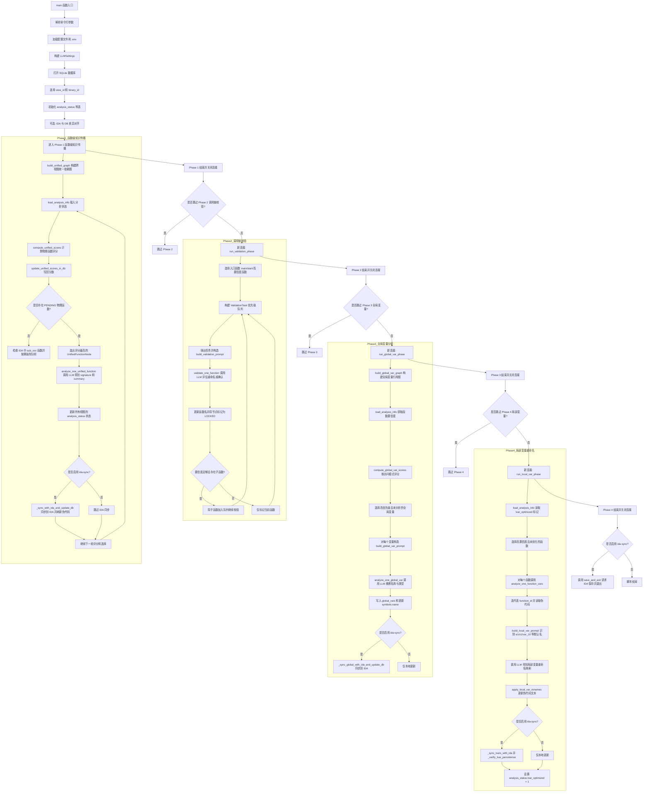

# ReBind Demo - 二进制语义对齐工具集

## 项目概述

ReBind Demo 是一个专注于二进制语义对齐技术的综合工具集，旨在为神经反编译研究提供高质量、细粒度的训练数据。本项目通过集成 IDA Pro 和 Ghidra 两大主流逆向工程工具，实现了"三层金字塔对齐法"（物理层、结构层、语义层），为大语言模型在代码理解与生成领域的训练提供多层次、细粒度的数据支持。

## 核心特性

- **多工具集成**：统一支持 IDA Pro 和 Ghidra Headless 模式
- **三层金字塔对齐**：
  - 物理对齐层：原始二进制指令与基本块的映射
  - 结构对齐层：函数边界与控制流图拓扑的映射
  - 语义对齐层：高级伪代码语句与变量的映射
- **自动化流水线**：提供批处理和 Python 脚本两种使用方式
- **标准化输出**：统一的输出格式便于后续数据处理和分析
- **语义对齐流水线**：`rebind_demo.py` 在 `--both` 模式完成 Ghidra+IDA 后会自动调用 `tools/Semantics_Alignment/semantic_align.py`，串联 `alignment_loader`、`idat_server.py` 与 `knowledge_propagation.py`，并可同步 IDA 以获得基于 LLM 的函数语义摘要。

## 项目结构

```
ReBind_demo/
├── rebind_demo.py              # 综合分析脚本 - 主入口
├── .env                        # 环境变量配置（OPENAI_API_KEY 等）
├── .gitignore                  # Git 忽略文件配置
├── README.md                   # 项目说明文档
├── tools/                      # 工具集目录
│   ├── Ghidra_Headless_Demo/   # Ghidra Headless 分析工具
│   │   ├── ghidra_adapter.py   # Ghidra Python 适配器
│   │   ├── ExtractBinaryInfo.py     # 提取符号/字符串/段/交叉引用
│   │   ├── ExtractDisassembly.py    # 提取按函数拆分的反汇编
│   │   ├── ExtractPseudocode.py     # 提取按函数拆分的伪代码
│   │   ├── config.yaml              # Ghidra 配置文件
│   │   ├── input_prehandle_start.bat # Windows 批处理入口
│   │   ├── ghidra_adapter.log       # Ghidra 运行日志
│   │   ├── README.md                # Ghidra 工具说明文档
│   │   ├── .gitignore               # Ghidra 工具 Git 忽略配置
│   │   └── __pycache__/             # Python 缓存目录
│   ├── IDA_Headless_Demo/           # IDA Headless 分析工具
│   │   ├── ida_adapter.py           # IDA Python 适配器
│   │   ├── ExtractBinaryInfo_IDA.py  # IDA 版本信息提取脚本
│   │   ├── ExtractDisassembly_IDA.py # IDA 版本反汇编提取脚本
│   │   ├── ExtractPseudocode_IDA.py  # IDA 版本伪代码提取脚本
│   │   ├── config.yaml              # IDA 配置文件
│   │   ├── input_prehandle_start.bat # Windows 批处理入口
│   │   ├── single_test.bat          # 单文件测试脚本
│   │   ├── ida_adapter.log          # IDA 运行日志
│   │   ├── README.md                # IDA 工具说明文档
│   │   └── __pycache__/             # Python 缓存目录
│   └── Semantics_Alignment/         # 语义对齐流水线
│       ├── alignment_loader.py      # 构建对齐数据库
│       ├── semantic_align.py        # 一键流水线入口脚本
│       ├── knowledge_propagation.py # LLM + 知识传播主流程
│       ├── idat_server.py           # IDA 同步 HTTP 服务
│       ├── config.yaml              # LLM 配置文件
│       ├── 语义对齐技术.md          # 语义对齐技术详细文档
│       └── __pycache__/             # Python 缓存目录
├── tmp/                        # 临时输出目录
│   ├── Malware_sample.exe      # 示例二进制文件
│   ├── Malware_sample.exe.i64  # IDA 数据库文件
│   ├── db_sample_dump.txt      # 数据库导出文本
│   ├── idat_log.txt            # IDA 同步服务日志
│   ├── Malware_sample_exe_ghidemo/  # Ghidra 分析输出
│   │   ├── ghidra_adapter.py        # Ghidra 适配器副本
│   │   ├── Malware_sample_exe_binaryinfo/   # 二进制信息
│   │   │   ├── Malware_sample_exe_symbols.csv   # 符号表
│   │   │   ├── Malware_sample_exe_segments.csv  # 段信息
│   │   │   ├── Malware_sample_exe_sections.csv  # 节信息
│   │   │   └── Malware_sample_exe_xrefs/        # 交叉引用目录
│   │   ├── Malware_sample_exe_disassembly/      # 反汇编代码
│   │   │   └── 0x{address}_{function_name}.asm  # 每个函数一个文件
│   │   └── Malware_sample_exe_pseudocode/       # 伪代码
│   │       └── 0x{address}_{function_name}.c    # 每个函数一个文件
│   └── Malware_sample_exe_idademo/  # IDA 分析输出
│       ├── Malware_sample_exe_binaryinfo/       # 二进制信息
│       │   ├── Malware_sample_exe_symbols.csv   # 符号表
│       │   ├── Malware_sample_exe_segments.csv  # 段信息
│       │   ├── Malware_sample_exe_sections.csv  # 节信息
│       │   └── Malware_sample_exe_xrefs/        # 交叉引用目录
│       ├── Malware_sample_exe_disassembly/      # 反汇编代码
│       │   └── 0x{address}_{function_name}.asm  # 每个函数一个文件
│       └── Malware_sample_exe_pesudocode/       # 伪代码（注意拼写）
│           └── 0x{address}_{function_name}.c    # 每个函数一个文件
└── __pycache__/                # Python 缓存目录
```

## 环境要求

### 基础环境
- **操作系统**：Windows 10/11
- **Python**：3.7+ （推荐 3.9+）
- **依赖库**：PyYAML
- **语义对齐依赖**：`openai`、`requests`、`tqdm`，用于 `tools/Semantics_Alignment` 中的 LLM 和 HTTP 同步；务必通过环境变量 `OPENAI_API_KEY`（可在仓库根目录的 `.env` 中配置）提供密钥。

### Ghidra 环境
- **Ghidra**：11.4.3+ （推荐 PUBLIC 版本）
- **Java**：JDK 11+ （Ghidra 运行依赖）

### IDA 环境
- **IDA Pro**：9.2+ （Professional 版本）
- **Hex-Rays Decompiler**：可选，用于伪代码生成

## 快速开始

### 1. 环境配置

#### Ghidra 配置
编辑 `tools/Ghidra_Headless_Demo/config.yaml`：
```yaml
ghidra:
  cmd_path: "E:\\Program Files (x86)\\ghidra_11.4.3_PUBLIC_20251203\\ghidra_11.4.3_PUBLIC\\support\\analyzeHeadless.bat"
  # 其他配置保持默认
```

#### IDA 配置
编辑 `tools/IDA_Headless_Demo/config.yaml`：
```yaml
ida:
  cmd_path: "C:\\Program Files\\IDA Professional 9.2\\idat.exe"
  args: "-A -c"
  # 其他配置保持默认
```

### 2. 使用方法

#### 方法一：综合脚本（推荐）
使用主入口脚本 `rebind_demo.py`：

```bash
# 同时使用 Ghidra 和 IDA 分析
python rebind_demo.py path/to/binary.exe

# 仅使用 Ghidra 分析
python rebind_demo.py --ghidra path/to/binary.exe

# 仅使用 IDA 分析
python rebind_demo.py --ida path/to/binary.exe

# 启用详细输出
python rebind_demo.py --verbose path/to/binary.exe

# 指定自定义配置文件
python rebind_demo.py --config custom_config.yaml path/to/binary.exe
```

#### 方法二：批处理文件
直接拖拽二进制文件到对应的批处理文件：
- `tools/Ghidra_Headless_Demo/input_prehandle_start.bat`
- `tools/IDA_Headless_Demo/input_prehandle_start.bat`

#### 方法三：Python 脚本
直接调用适配器脚本：
```bash
# Ghidra
cd tools/Ghidra_Headless_Demo
python ghidra_adapter.py path/to/binary.exe

# IDA
cd tools/IDA_Headless_Demo
python ida_adapter.py path/to/binary.exe
```

## 输出结构

分析完成后，会在输入文件所在目录生成对应的工作目录：

### Ghidra 输出结构
```
[filename]_ghidemo/
├── [filename]_disassembly/      # 每个函数一个 .asm 文件
├── [filename]_binaryinfo/       # 各类 CSV 输出
│   ├── [filename]_symbols.csv   # 符号信息
│   ├── [filename]_segments.csv  # 段信息
│   ├── [filename]_sections.csv  # 节信息
│   └── [filename]_xrefs/        # 交叉引用（每个符号一个 CSV）
└── [filename]_pseudocode/       # 每个函数一个 .c 伪代码文件
```

### IDA 输出结构
```
[filename]_idademo/
├── [filename]_disassembly/      # 每个函数一个 .asm 文件
├── [filename]_binaryinfo/       # 各类 CSV 输出
│   ├── [filename]_symbols.csv   # 符号信息
│   ├── [filename]_strings.csv   # 字符串信息
│   ├── [filename]_segments.csv  # 段信息
│   ├── [filename]_sections.csv  # 节信息
│   └── [filename]_xrefs/        # 交叉引用（每个符号一个 CSV）
└── [filename]_pseudocode/       # 每个函数一个 .c 伪代码文件（需要 Hex-Rays）
```

## 阶段 1：统一对齐数据库（alignment_loader.py）

在不修改 Ghidra / IDA 脚本的前提下，本项目先实现了一个“阶段 1 的统一对齐数据库”，用于把两套工具的输出汇总到一个 SQLite 中，形成后续物理/结构/语义对齐的基础视图。

### 阶段 1 目标

- 仅使用现有输出文件：
  - `*_binaryinfo/*.csv`（segments / sections / symbols / strings / xrefs）
  - `*_disassembly/*.asm`（每个函数一个反汇编）
  - `*_pseudocode/*.c` 或 `*_pesudocode/*.c`（每个函数一个伪代码）
- 不做 basic block 和语句级拆分，只做到：
  - 段 / 节 / 符号 / 字符串 / 交叉引用
  - 函数 + 指令序列
  - 函数级伪代码文本
- 为后续的“三层金字塔对齐法”提供一个“工具无关”的基础数据模型。

### 使用方式

1. 先用前文的方法跑出 Ghidra / IDA 的 demo 输出，例如：
   - `tmp/Malware_sample_exe_ghidemo/`
   - `tmp/Malware_sample_exe_idademo/`
2. 在仓库根目录运行：

```bash
python alignment_loader.py ^
  --db tmp/alignment_demo.db ^
  --ghidra-dir tmp/Malware_sample_exe_ghidemo ^
  --ida-dir    tmp/Malware_sample_exe_idademo
```

执行完成后，会在 `tmp/alignment_demo.db` 里生成统一的对齐视图，可用任何 SQLite 浏览器或 `sqlite3`/Python 直接查看。

### 表结构概览（阶段 1）

当前版本的对齐数据库主要包含如下几类表（字段详见 `alignment_loader.py`）：

- **工具与二进制视图**
  - `tools`：记录分析工具信息（`ghidra` / `ida`、版本号等）。
  - `binaries`：逻辑上的“同一个二进制”（用视图目录名去掉 `_ghidemo/_idademo` 作为键）。
  - `binary_views`：某工具对某个二进制的一次分析视图（包含 `output_dir`、`image_base`）。

- **物理层相关**
  - `segments`：段信息，来自 `*_segments.csv`，带读写执行权限。
  - `sections`：节信息，来自 `*_sections.csv`。
  - `symbols`：符号表，统一解析 Ghidra/IDA 的 `*_symbols.csv`，并归一化 `kind=function/label/data/import`。
  - `strings`：IDA 输出的字符串表，来自 `*_strings.csv`。

- **函数与反汇编**
  - `functions`：函数入口 VA + 函数名 + 来源文件（`.asm/.c`），按 `view_id + entry_va` 唯一。
  - `instructions`：每条指令的 `address_va / bytes / mnemonic / op_str / raw_line`，从各函数的 `.asm` 中解析。

- **伪代码与交叉引用**
  - `pseudo_functions`：函数级伪代码视图，保存 prototype 和完整 C 函数体。
  - `xrefs`：统一的交叉引用视图，从 Ghidra/IDA 的 `*_xrefs/*.csv` 抽象为 `src_va → dst_va/dst_name`。

在这个阶段，IDA 和 Ghidra 的视图已经可以通过：

- `binaries.filename`（逻辑二进制名称）
- `functions(entry_va)`（函数入口地址）

进行函数级的物理 + 伪代码对齐，为后续在 `语义对齐技术.md` 中设计的“语句级 / 变量级对齐”提供了可操作的基础数据集。

## 语义对齐流水线

### ReBind Demo 与自动语义对齐

- `rebind_demo.py` 默认在 `--both` 模式下完成 Ghidra 与 IDA 分析后会调用 `tools/Semantics_Alignment/semantic_align.py`，`run_semantic_align` 会依次串联 `alignment_loader`、`idat_server.py` 和 `knowledge_propagation.py`，并尝试将 LLM 生成的函数签名/摘要同步回 IDA。
- 如需只运行单一工具并跳过语义对齐，可明确传入 `--ghidra` 或 `--ida`，这些参数会绕过上面的链路。

### 手动运行 semantic_align.py

默认等价于依次执行 `alignment_loader`、以 `idat_server.py` 启动 IDA（`idat`）再调用 `knowledge_propagation.py`。样例命令：

```bash
python tools/Semantics_Alignment/semantic_align.py --sample tmp/Malware_sample.exe
```

可调参数包括：

- `--db` / `--ghidra-dir` / `--ida-dir`：自定义 SQLite 数据库与分析目录。
- `--max-functions` / `--max-lvar-funcs`：控制本次知识传播与局部变量整理处理多少个函数。
- `--ida-start-delay`：在启动 `idat` 后等待的秒数（默认 3 秒）。
- `--no-align`：跳过 `alignment_loader` 阶段以复用已有数据库。
- `--no-ida`：只执行离线 `knowledge_propagation.py`，不启动 IDA 且不做 IDA 同步。
- `--idat-exe` / `--ida-script` / `--ida-url`：分别指定 `idat` 可执行文件、`idat_server.py` 路径与 HTTP 服务地址。

脚本会在样本目录下生成 `{sample_name}.db`（例如 `Malware_sample.exe.db`）、`db_sample_dump.txt/.xlsx` 和 `idat_log.txt` 等产物，方便后续审阅。

### 配置与 LLM 环境

`semantic_align.py` 与 `knowledge_propagation.py` 共享 `tools/Semantics_Alignment/config.yaml` 中的 LLM 配置（模型、temperature、max_tokens、API 地址/类型），并会尝试从仓库根目录的 `.env` 中读取 `OPENAI_API_KEY`。请根据自己的 LLM 提供商更新 YAML，在版本控制中避免泄露真实密钥（可通过 `.env` 或系统环境变量设置）。

### IDA 同步服务

`tools/Semantics_Alignment/idat_server.py` 在 `idat` 中开启一个轻量 HTTP 服务（默认监听 `127.0.0.1:12345`），响应 `rename_and_sync`、`rename_global`、`rename_lvar` 与 `save_and_exit` 请求，支持函数/全局/局部变量重命名、类型应用、伪代码刷新，并在退出时优雅保存数据库、清理 `.id0/.id1`。

### 知识传播阶段概览

`knowledge_propagation.py` 使用 `alignment_loader` 生成的 SQLite 数据库，在 `analysis_status` 表上维护 `PENDING`/`ANALYZED`/`LOCKED` 状态后构建跨视图统一图（`UnifiedGraph`），并按启发式分数逐个函数调用 LLM 生成签名与语义摘要，结果写回 `analysis_status`：

- **阶段 1**：LLM 知识传播（`--max-functions`、`--dry-run` 控制）；可选开启 `--ida-sync` 把更新同步给 IDA。
- **阶段 2**：调用链 Top-down 校验（`--skip-validation` 跳过）。
- **阶段 3**：全局变量重命名与类型推断（`--skip-global` 跳过）。
- **阶段 4**：局部变量可读性整理（`--skip-lvar` 或 `--max-lvar-funcs` 控制）。

默认会上传 `tools/Semantics_Alignment/config.yaml` 中的 API 设置并在 `<db>.knowledge.log` 中记录进度，便于调试与复现。

## 技术原理

### 三层金字塔对齐法

| 层级 | 名称 | 定义 | 关键数据特征 | 对齐锚点 |
|------|------|------|------------|----------|
| Layer 1 | 物理对齐层 | 原始二进制指令与基本块的映射 | 机器码、汇编指令、字节序列 | 绝对地址 (VA) / 相对地址 (RVA) |
| Layer 2 | 结构对齐层 | 函数边界与控制流图拓扑的映射 | 函数入口、CFG边、基本块关系 | 函数入口地址、MD-Index |
| Layer 3 | 语义对齐层 | 高级伪代码语句与变量的映射 | C伪代码行、变量名、类型定义 | 指令溯源地址 (Instruction EA) |

### 地址标准化

为了解决 IDA 和 Ghidra 之间的地址空间异构性问题，系统采用以下标准化流程：

1. **基址提取**：
   - IDA：`ida_nalt.get_imagebase()`
   - Ghidra：`currentProgram.getImageBase()`

2. **地址转换**：
   ```
   RVA = VA - ImageBase
   ```

3. **对齐操作**：
   ```python
   # 伪代码示例
   aligned_data = join_on_rva(ida_data, ghidra_data)
  ```

## LLM 驱动的可编译流水线

为了把 IDA/Ghidra 的伪代码推进到可编译的状态，从“上下文”、“编译循环”、“验证”三条主线出发，可以逐步构建出一个可落地的“LLM + 编译器”闭环。

### 阶段 1：构建可编译上下文（The Context Problem）

- **类型全集**：先从 IDA 的 Local Types 导出所有 `struct`/`enum`/`typedef`，输出到 `types.h`（或 `common.h`），并补齐 `_DWORD`、`_BYTE` 等 IDA 特有的别名宏，LLM 修复函数时必须 `#include` 这个头。
- **原型桩**：生成一个 `prototypes.h`，包含所有识别到的函数签名（`extern return_t func(args);`），让编译器能够解析跨函数调用。
- **栈帧信息**：如果有 Stack view，可把栈大小（`stacksize`）和每个局部变量的偏移（`-0x10 = var_A`）交给 LLM，让它还原出 `char buf[0x40]`、`struct X *ptr`，避免把数组拆成一堆 `v1/v2`。
- **Prompt 构造**：给 LLM 的输入要包含环境——“types.h 内容”、“prototypes.h 内容”、“当前函数的伪代码/汇编/栈帧”，再加上目标：让函数“保持语义，生成 GCC 可编译的 C 代码”。若无法确定的部分，可要求在 `__asm__` 中保留原始汇编。

### 阶段 2：LLM 驱动的编译循环（The Compilation Loop）

- **增量编译**：不一次性编译所有输出；以函数为单位生成 `.c`、`gcc -c func.c -o func.o`，只在依赖都解决后再 `ld`/链接。这样能快速定位编译错误。
- **错误反馈**：把当前函数代码、GCC stderr（含行号）和对应汇编段（如 `MOV [RAX+4], 0`）都发给 LLM，使其还原出原本的字段写法（例如 `node->field = 0;`），并避免随意简化控制流。
- **幻觉控制**：要求 LLM 尽量使用标准 C 语法，不能省略循环/分支；对于不可恢复的片段，用 `__asm__` 包裹原始指令作为保底。持续循环“编译器 -> 错误 -> LLM”直到不再报错。

### 阶段 3：对齐与验证（The Verification Strategy）

- **编译选项对齐**：从 `Meta` 模块识别原始二进制的 `-O` 等级和编译器家族（MSVC vs GCC/Clang），尽量复用原编译器链，确保 `NewBin`/`BaseBin` 的产物在 Bindiff/Diaphora 中有可比性。
- **验证层级**：按语法（编译器不报错）→ 结构（控制流图 CFG 相似）→ 二进制（Bindiff 指令相似度）逐层验证。若 CFG 区别较大或基本块分支数减少，说明语义被 LLM 篡改。
- **SemCheck/Score 接口**：把这些验证结果写入 `Semantics_Alignment` 的评分机制，指示哪些函数可进入下一轮训练。

### 可落地的下一步

1. **数据清洗脚本**：在 `tools` 或 `tmp` 目录下写一个脚本，从 IDA 输出目录抽取 `all_types.h`、`prototypes.h`、`target_func.c`（伪代码 + 汇编 + stack info），做成一个打包的上下文包。
2. **编译哈束（Compilation Harness）**：先手工跑一个示例函数，配置 Docker/虚拟机内的 GCC/Clang，运行 `gcc -c`，记录 stderr 供 LLM 使用；确认 `.o` 用来测试链接链。
3. **LLM 交互测试**：把 Hex-Rays 伪代码 (含大量 `(int *)v3`、`*(int *)(v1 + 4)` 等) 与 `types.h`/`prototypes.h`、报错和汇编片段一起喂给 LLM，Prompt 示例：

   ```
   Refactor this decompiled C code to be valid, compilable C code. Include types from types.h and prototypes.h. Keep the control flow unchanged; when unsure, fallback to __asm__ blocks.
   ```

4. **Stack Frame 反馈**：把 IDA Stack view 的栈大小和偏移也放进 Prompt，让 LLM 识别 `char buf[0x40]`、`int idx` 而不是 `int v1, v2, ...`。
5. **采集三层金字塔素材**：在 `alignment_loader` 里继续把汇编/伪代码/类型/stack info 聚合，并在后续 `knowledge_propagation` 中把这些结构也传给 LLM，以便生成更加严谨的代码。

完成上述几个点后，就可以把这个编译哈束逐步自动化，把 `SemCheck` 得分最低的函数交给 LLM 处理再编译，以形成“LLM + 编译器 + 验证”的闭环。

## 配置详解

### 通用配置项

两个工具的配置文件都包含以下通用配置项：

```yaml
# 输出配置
output:
  dir_suffix: "_toolname_demo"    # 输出目录后缀
  keep_python_scripts: false      # 是否保留临时脚本
  keep_input_copy: false          # 是否保留输入文件副本

# 文件名处理
filename:
  sanitize: true                  # 是否清理文件名
  allowed_chars_pattern: "[A-Za-z0-9]"  # 允许的字符模式
  replacement_char: "_"           # 替换字符

# 日志配置
logging:
  level: "INFO"                   # 日志级别
  log_to_file: true              # 是否输出到文件
  log_file_path: ""              # 日志文件路径
```

### 工具特定配置

#### Ghidra 特定配置
```yaml
ghidra:
  cmd_path: "path/to/analyzeHeadless.bat"  # Ghidra 命令路径
  project_name_prefix: "MyPEAnalysisTemp"  # 项目名前缀
  workspace: ""                             # 工作空间目录

scripts:
  post_scripts:                            # 要执行的脚本列表
    - "ExtractBinaryInfo.py"
    - "ExtractDisassembly.py"
    - "ExtractPseudocode.py"
  script_path: ""                          # 脚本搜索路径
```

#### IDA 特定配置
```yaml
ida:
  cmd_path: "path/to/idat.exe"             # IDA 命令路径
  args: "-A -c"                           # 命令行参数

scripts:
  scripts:                                # 要执行的脚本列表
    - "ExtractBinaryInfo_IDA.py"
    - "ExtractDisassembly_IDA.py"
    - "ExtractPseudocode_IDA.py"
```

## 故障排除

### 常见问题

1. **找不到工具命令**
   - 检查配置文件中的 `cmd_path` 是否正确
   - 确认工具已正确安装且可访问

2. **伪代码生成失败**
   - IDA：确认 Hex-Rays 插件已正确安装和授权
   - Ghidra：确认反编译器功能正常

3. **输出目录为空**
   - 检查输入文件是否为有效的二进制文件
   - 查看日志文件了解详细错误信息

4. **内存不足**
   - 对于大型二进制文件，考虑增加系统内存
   - 可以分批处理多个文件

### 日志分析

两个工具都会生成详细的日志文件：
- Ghidra：`tools/Ghidra_Headless_Demo/ghidra_adapter.log`
- IDA：`tools/IDA_Headless_Demo/ida_adapter.log`

使用 `--verbose` 参数可以实时查看详细输出。

## 扩展开发

### 添加新的提取脚本

1. 在对应工具目录下创建新的 Python 脚本
2. 实现标准的脚本接口（参考现有脚本）
3. 在配置文件中添加脚本到执行列表

### 自定义输出格式

可以通过修改适配器类中的 `process_output_files` 方法来自定义输出格式和文件组织结构。

### 集成其他工具

参考现有适配器的实现模式，为新工具创建相应的适配器类，并在主脚本中添加集成逻辑。

## 技术支持

如遇到问题或需要技术支持，请：

1. 查看详细的日志文件
2. 检查配置文件是否正确
3. 确认环境依赖是否满足
4. 参考 `语义对齐技术.md` 文档中的详细技术说明

## 许可证

本项目遵循开源许可证，具体请参考各工具目录下的许可证文件。

## 致谢

本项目的实现得益于以下开源项目和工具：
- NSA Ghidra
- Hex-Rays IDA Pro
- Diaphora 二进制比对工具
- BinExport 导出工具
- CodableLLM 框架设计理念

