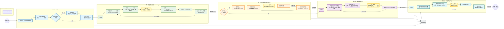

# ReBind Demo - 二进制语义对齐工具集

## 项目概述

ReBind Demo 是一个专注于二进制语义对齐技术的综合工具集，旨在为神经反编译研究提供高质量、细粒度的训练数据。本项目通过集成 IDA Pro 和 Ghidra 两大主流逆向工程工具，实现跨工具的函数语义对齐与分析，提升逆向工程的效率和准确性。

```mermaid
---
config:
  layout: dagre
---
flowchart LR
 subgraph Init["初始化与对齐"]
    direction TB
        LoadDB["加载 SQLite 数据库 & 配置"]
        BuildGraph["构建统一依赖图<br>聚合 Ghidra/IDA 视图"]
        SyncCheck{"检测 IDA/DB<br>一致性"}
        Reconcile["LLM 裁决<br>解决命名/代码冲突"]
        ScoreInit["初始评分计算<br>API/字符串/结构特征"]
  end
 subgraph Phase1["第一阶段: 知识传播 Bottom-Up"]
    direction TB
        P1_Start("开始 P1")
        P1_Pick["挑选高分 PENDING 函数<br>优先叶子节点/工具函数"]
        P1_Context["构建 Prompt 上下文<br>汇编 + 伪代码 + <b>已分析子函数摘要</b>"]
        P1_LLM[["LLM 分析<br>生成签名 &amp; 语义摘要"]]
        P1_UpdateDB["更新 Analysis Status<br>状态设为 ANALYZED/LOCKED"]
        P1_Recalc["重新计算父节点分数<br>知识向上传播"]
        P1_SyncIDA["可选: 同步重命名到 IDA"]
  end
 subgraph Phase2["第二阶段: 逻辑校验 Top-Down"]
    direction TB
        P2_Prompt{"用户确认<br>进入校验?"}
        P2_Select["选择入口点<br>Main 或 高置信度函数"]
        P2_Context["构建调用链 Prompt<br>提取<b>调用者</b>的使用片段"]
        P2_LLM[["LLM 校验<br>RENAME 或 CONFIRM"]]
        P2_Propagate["向下传播置信度<br>将子函数加入校验队列"]
        P2_Result["更新状态为 LOCKED"]
  end
 subgraph Phase3["第三阶段: 全局变量分析"]
    direction TB
        P3_Start("开始 P3")
        P3_Filter["筛选高优先级全局变量<br>基于被高置信度函数引用的次数"]
        P3_Context["提取访问上下文<br>读取/写入该变量的代码片段"]
        P3_LLM[["LLM 推断<br>猜测变量名 g_Var &amp; 类型"]]
        P3_Update["更新 Global Vars 表 & IDA"]
  end
 subgraph Phase4["第四阶段: 局部变量优化"]
    direction TB
        P4_Start("开始 P4")
        P4_Select["选择已完成分析的函数"]
        P4_Prompt["构建重构 Prompt<br>目标: 消除 v1, a2 等默认名"]
        P4_LLM[["LLM 重命名<br>返回映射 Map"]]
        P4_Apply["正则替换伪代码"]
        P4_Verify["验证持久化<br>确保无默认名残留"]
  end
 subgraph s1["Untitled subgraph"]
        n1["Untitled Node"]
  end
    Start(("脚本启动")) --> Init
    LoadDB --> BuildGraph
    BuildGraph --> SyncCheck
    SyncCheck -- 不一致 --> Reconcile
    SyncCheck -- 一致 --> ScoreInit
    Reconcile --> ScoreInit
    ScoreInit --> P1_Start
    P1_Start --> P1_Pick
    P1_Pick --> P1_Context
    P1_Context --> P1_LLM
    P1_LLM --> P1_UpdateDB
    P1_UpdateDB --> P1_SyncIDA
    P1_SyncIDA --> P1_Recalc
    P1_Recalc -- 还有未分析函数 --> P1_Pick
    P1_Recalc -- 无剩余或无高分 --> P2_Prompt
    P2_Prompt -- 是 --> P2_Select
    P2_Select --> P2_Context
    P2_Context --> P2_LLM
    P2_LLM --> P2_Result
    P2_Result -- 高置信度 --> P2_Propagate
    P2_Propagate --> P2_Context
    P2_Propagate -- 队列清空 --> P3_Start
    P2_Prompt -- 否 --> P3_Start
    P3_Start --> P3_Filter
    P3_Filter --> P3_Context
    P3_Context --> P3_LLM
    P3_LLM --> P3_Update
    P3_Update -- 下一个变量 --> P3_Filter
    P3_Update -- 所有变量处理完 --> P4_Start
    P4_Start --> P4_Select
    P4_Select --> P4_Prompt
    P4_Prompt --> P4_LLM
    P4_LLM --> P4_Apply
    P4_Apply --> P4_Verify
    P4_Verify -- 下一个函数 --> P4_Select
    P4_Verify -- 完成所有 --> End(("结束 & 保存"))
    Init <--> DB[("SQLite DB")]
    Phase1 <--> DB
    Phase2 <--> DB
    Phase3 <--> DB
    Phase4 <--> DB

     LoadDB:::init
     BuildGraph:::init
     SyncCheck:::init
     Reconcile:::init
     ScoreInit:::init
     P1_Start:::p1
     P1_Pick:::p1
     P1_Context:::p1
     P1_LLM:::llm
     P1_UpdateDB:::p1
     P1_Recalc:::p1
     P1_SyncIDA:::p1
     P2_Prompt:::p2
     P2_Select:::p2
     P2_Context:::p2
     P2_LLM:::llm
     P2_Propagate:::p2
     P2_Result:::p2
     P3_Start:::p3
     P3_Filter:::p3
     P3_Context:::p3
     P3_LLM:::llm
     P3_Update:::p3
     P4_Start:::p4
     P4_Select:::p4
     P4_Prompt:::p4
     P4_LLM:::llm
     P4_Apply:::p4
     P4_Verify:::p4
     DB:::storage
    classDef init fill:#e1f5fe,stroke:#01579b,stroke-width:2px
    classDef p1 fill:#e8f5e9,stroke:#2e7d32,stroke-width:2px
    classDef p2 fill:#fff3e0,stroke:#ef6c00,stroke-width:2px
    classDef p3 fill:#f3e5f5,stroke:#7b1fa2,stroke-width:2px
    classDef p4 fill:#e0f7fa,stroke:#006064,stroke-width:2px
    classDef storage fill:#eceff1,stroke:#455a64,stroke-width:2px,stroke-dasharray: 5 5
    classDef llm fill:#fff9c4,stroke:#fbc02d,stroke-width:2px
```